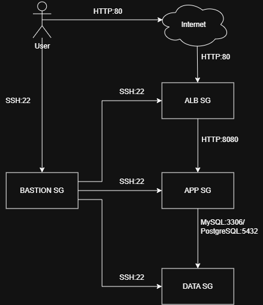

# Security 

## Security Group Rules

** Security Group Diagram **

### vpc-bastion

| Direction | Port | Source / Destination | Purpose |
|-----------|------|----------------------|---------|
| Inbound | 22 | 92.209.213.67/32 | SSH from my laptop |
| Outbound | 22 | vpc-data-tier-sg, vpc-app-tier-sg | Hop to tiers for debugging purpose |

### vpc-alb-sg

| Direction | Port | Source / Destination | Purpose |
|-----------|------|----------------------|---------|
| Inbound | 80 | 0.0.0.0/0 | Public HTTP (internet-facing) |
| Inbound | 443 | 0.0.0.0/0 | Public HTTPS |
| Outbound | All | 0.0.0.0/0 | Package downloads |

### vpc-app-tier-sg

| Direction | Port | Source / Destination | Purpose |
|-----------|------|----------------------|---------|
| Inbound | 8080 | vpc-alb-sg | App traffic from ALB |
| Inbound | 80 | vpc-alb-sg | App traffic from ALB |
| Inbound | 22 | vpc-bastion | SSH via bastion only |
| Outbound | 3306 | sg-database | MySQL queries |
| Outbound | 5432 | sg-database | PostgreSQL queries |
| Outbound | 443 | 0.0.0.0/0 | Package downloads |

### vpc-data-tier-sg

| Direction | Port | Source / Destination | Purpose |
|-----------|------|----------------------|---------|
| Inbound | 3306 | sg-app-tier | MySQL from app tier only |
| Inbound | 5432 | sg-app-tier | PostgreSQL from app tier only |
| Inbound | 22 | sg-bastion | SSH via bastion only |
| Outbound | 443 | 0.0.0.0/0 | Package downloads |

## Network Isolation Strategy

- Database can only receive requests from application tier. 
- Application tier does not listen directly to the internet (remains private) 
- Only Application Load Balancer can send requests which come from the internet. 
- Bastion only accessible from local IP.

## Security best practices applied

- ✅ Security Groups reference to other security groups instead of CIDR ranges. 
- ✅ Database is not exposed to the Internet.
- ✅ Application servers are not directly reachable from the Internet.
- ✅ Only the ALB accepts public traffic.
- ✅ Administrative access is isolated through a bastion.
- ✅ Tiered architecture to reduce direct attack paths.

## Potential vulnerabilities and mitigations

- Bastion for debugging makes the network vulnerable as there is an entity allowed to access all tiers. Use Session Manager instead. 
- HTTP does not encrypt requests. Use HTTPS instead. 
- Default outbound rule to all trafic may cause a compromised EC2 Instance to connect to arbitrary Internet destinations. Use Network ACL with custom rules. 
- Although the database is not publicly accessible, the attacker can legitimately connect because the App SG is trusted. Database authentication with least privilege can be useful. 
