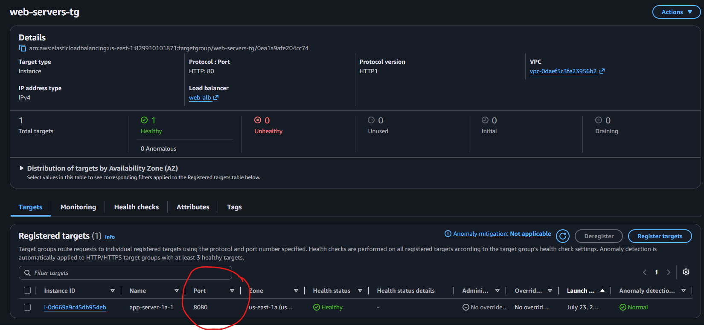
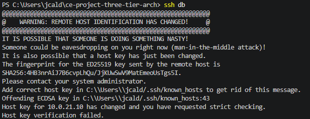

# Project Issues

## Application Instance Unhealthy

### Description Issue

Application server is marked as unhealthy at the first start. 

Output:
```bash
  throw err;
  ^

Error: Cannot find module 'pg'
Require stack:
- /home/ec2-user/server.js
    at Module._resolveFilename (node:internal/modules/cjs/loader:1140:15)
    at Module._load (node:internal/modules/cjs/loader:981:27)
    at Module.require (node:internal/modules/cjs/loader:1231:19)
    at require (node:internal/modules/helpers:177:18)
    at Object.<anonymous> (/home/ec2-user/server.js:3:20)
    at Module._compile (node:internal/modules/cjs/loader:1364:14)
    at Module._extensions..js (node:internal/modules/cjs/loader:1422:10)
    at Module.load (node:internal/modules/cjs/loader:1203:32)
    at Module._load (node:internal/modules/cjs/loader:1019:12)
    at Function.executeUserEntryPoint [as runMain] (node:internal/modules/run_main:128:12) {
  code: 'MODULE_NOT_FOUND',
  requireStack: [ '/home/ec2-user/server.js' ]
}

Node.js v18.20.8
```

### Solution

Run ```bash npm install pg``` to install the dependency needed. 
Run ```bash sudo chmod 777 app.log``` to allow edition of app.log file.
Run the application using the command ```bash sudo nohup node server.js > app.log 2>&1 &```.


## Application Not Running on Restart

### Description Issue

Application is not running again after restarting. A manual restart of the application is needed. 

### Solution

Run the following commands: 

```bash
sudo npm install -g pm2   # install PM2 globally so the `pm2` command is available system-wide

mkdir app
mv server.js app/server.js

cat > ~/app/ecosystem.config.js <<'EOF'
module.exports = {
  apps: [{
    name: 'server-app',                               // the name PM2 shows in `pm2 list`
    script: 'server.js',                              // the file PM2 runs
    env: { NODE_ENV: 'production', PORT: 8080 }        // environment variables passed to the app
  }]
};
EOF

cd ~/app
pm2 start ecosystem.config.js   # start the app defined in the ecosystem file (applies the env block)
pm2 list                        # show all PM2-managed processes and their status

pm2 startup
sudo env PATH=$PATH:/usr/bin /usr/lib/node_modules/pm2/bin/pm2 startup systemd -u ec2-user --hp /home/ec2-user
pm2 save                            # snapshot the current process list so it is restored on boot
systemctl is-enabled pm2-ec2-user   # confirm the PM2 boot service is registered; should print: enabled
```

## Application Crashes with PM2

### Description Issue

Application errored due to issue with port 80 

### Solution

Replace port from 80 to 8080 in script: 

```bash
server.listen(8080, () => {
  console.log(`App server running (Instance: ${INSTANCE_ID})`);
});
```

Register target in Target Group with port 8080




Run ```bash pm2 reload app-server ``` to reload the application. 

Run ```bash curl localhost:8080/health ``` to check if health status is correct

---

## Host key verification failed

### Description Issue

Database connection through bastion refused due to warning "Remote host identification has changed!" 



### Solution

Run the following command to remove any key that the db IP address may have attached: 

```bash
ssh-keygen -R DB-PRIVATE-IP
```

Try to access again using bastion.

---

## Database not responding to ports 3306 or 5432

### Description Issue

Database instance is not running simulated responses

### Troubleshooting

Run ```bash sudo ss -tulpn | grep :3306 ``` to check the current responses on the specific port 

### Solution

NCat was not installed properly when running the script in the instance creation. 

If the instance is already created, run ```bash sudo dnf install nmap-ncat ``` to install the dependency. 

To solve the issue permanently (create a healthy database instance), modify the userdata script as follows: 

```bash
#!/bin/bash
# This simulates a database server
# In production, you'd use RDS, not EC2

sudo yum update -y
sudo yum install -y nc netcat
sudo dnf install -y nmap-ncat
```

---

